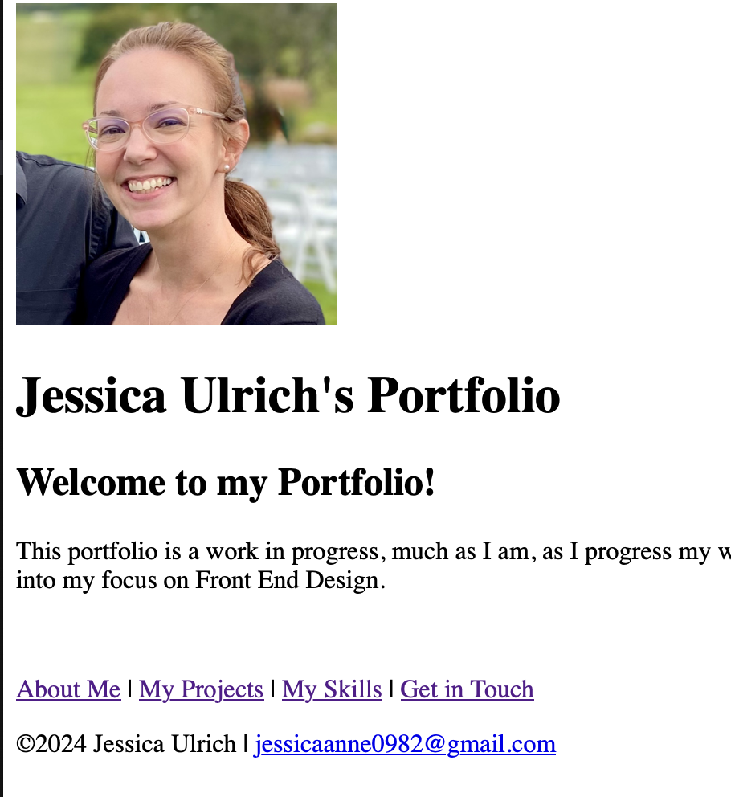

# Personal Portfolio

This is an online version of my portfolio and contains information about me, my projects, my skills, and how to contact me.

## Installation

There is nothing to install to run this file; however, you will need to download all the associated files.  Once downloaded, simply open the home_page.html file, and it will open in your default web browser. You will be able to follow the links on that page as long as the other files have downloaded as well.

## Necessary Files
1. home_page.html
2. about_me.html
3. projects.html
4. skills.html
5. contact.html
6. images directory and all images inside

## Usage
Open the home_page.html file as seen below and click to follow the links.

- The About Me Page includes my background, education, and career goals as well as a few tidbits about myself.
- The My Projects page displays the projects I've worked on up to this point at Coding Temple.
- The My Skills page presents programming languages I've learned so far in my educational journey.
- The Get in Touch page features a short form to fill out if you'd like me to contact you or my LinkedIn Profile link
